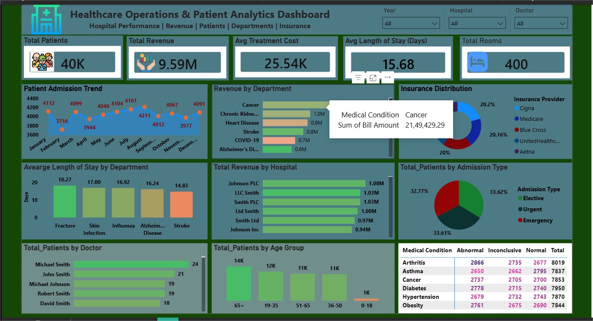

# Healthcare Operations & Patient Analytics Dashboard

This project presents an interactive **Healthcare Operations & Patient Analytics Dashboard** built using **Power BI**.  
The dashboard analyzes hospital data to uncover insights about patient trends, treatment costs, hospital performance, and operational efficiency.

---

## Dashboard Preview

---

## Key Metrics

- **40K+ patient records analyzed**
- **$9.59M total hospital revenue**
- **Average hospital stay: 15.6 days**
- **Average treatment cost: $25.5K**
- **400 hospital rooms analyzed**

---

## Dashboard Features

The dashboard includes the following analytical views:

### Patient Analysis
- Patient admission trend over time
- Patients distribution by age group
- Patients by doctor

### Financial Insights
- Total hospital revenue
- Revenue by hospital
- Revenue by medical condition

### Operational Metrics
- Average length of stay by department
- Admission type distribution (Emergency / Urgent / Elective)
- Insurance provider distribution

### Medical Insights
- Test results by medical condition
- Department-level patient insights

---

## Tools & Technologies Used

- **Power BI**
- **DAX (Data Analysis Expressions)**
- **Data Modeling**
- **Data Visualization**
- **Interactive Dashboard Design**

---

## Dataset

Two healthcare datasets were used for this analysis:

- `healthcare_dataset.csv`
- `hospital_records_2021_2024_with_bills.csv`

These datasets simulate hospital records including patient demographics, medical conditions, billing amounts, admission types, and insurance providers.

---

## Insights from the Dashboard

Some insights discovered from the analysis:

- Cancer and chronic diseases generate the highest hospital revenue.
- Admission types are relatively evenly distributed between emergency, urgent, and elective cases.
- Certain medical conditions require significantly longer hospital stays.
- Patient distribution is higher among older age groups.

---

## Project Files

Repository structure:

---

## Author

**Navdeep Khandelwal**

Aspiring Data Analyst focused on **Power BI, Data Analytics, and Business Intelligence dashboards**.

---

## Connect With Me

LinkedIn:  
https://www.linkedin.com/

GitHub:  
https://github.com/navdeepkhandelwal

